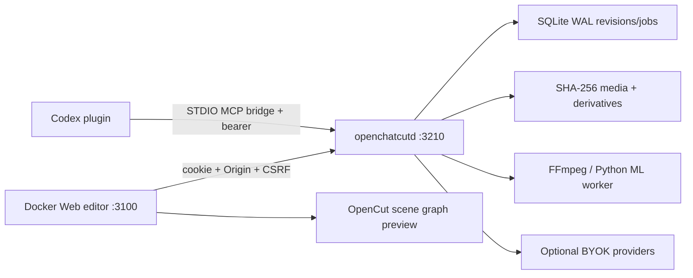

# OpenChatCut

Local-first, agentic, open-source video editing built on the OpenCut Classic
timeline. OpenChatCut is an independent implementation of public AI editing
workflows; it contains no ChatCut source, brand assets, proprietary templates,
or hosted account/billing system.

> **Development status:** the repository now contains the revision-safe local
> core, Web editor integration surfaces, Codex plugin/MCP bridge, semantic
> captions, local media worker, provider protocol, MG safety runtimes, and
> professional headless exporters. Optional heavyweight ML and paid-provider
> adapters are reported as unavailable by the daemon until installed. The API deliberately
> returns `CAPABILITY_UNAVAILABLE` instead of fabricating output.

## Install and run

Prerequisites: Git, Docker Desktop/Compose, Rust, Python 3.11+, Node.js 20+, and Codex CLI.
FFmpeg/ffprobe are required for audio processing and export.

### macOS / Linux

One-command source install (builds, installs the plugin when Codex is present,
and starts OpenChatCut):

```bash
./scripts/install.sh
```

The equivalent Windows command is `.\scripts\install.ps1`. The expanded steps
below remain useful for troubleshooting or custom installations.

```bash
git clone <your-openchatcut-repository-url> open-chat-cut
cd open-chat-cut
./scripts/setup.sh
codex login
./scripts/openchatcut.sh start
./scripts/install-codex-plugin.sh
```

### Windows PowerShell

```powershell
git clone <your-openchatcut-repository-url> open-chat-cut
cd open-chat-cut
.\scripts\setup.ps1
codex login
.\scripts\openchatcut.ps1 start
.\scripts\install-codex-plugin.ps1
```

Open <http://127.0.0.1:3100/projects>. The daemon listens only on
`127.0.0.1:3210`. After installing or updating the plugin, **open a new Codex
task** so the cached plugin and MCP process are refreshed.

If port `3100` is already occupied, keep the daemon on `3210` and choose another
loopback Web port when starting (use the same value for later restarts):

```bash
OPENCHATCUT_WEB_PORT=3110 ./scripts/openchatcut.sh start
```

Then open <http://127.0.0.1:3110/projects>. Changing this value while the daemon
is already running requires `OPENCHATCUT_WEB_PORT=3110 ./scripts/openchatcut.sh restart`
so its editor URL and Origin allowlist are updated together.

### Constrained all-Docker CPU profile

For an isolated CPU-only evaluation that also containers the daemon, FFmpeg,
Chromium worker, and MG compiler:

```bash
docker compose --profile full-cpu up -d --build
```

Both published ports remain host-loopback-only. The daemon binds the container's
unspecified interface only behind that explicit profile so Docker port forwarding
can reach it; its Web/worker origins are fixed by the profile. This constrained
profile intentionally omits host Codex OAuth, GPU acceleration, paid-provider
keys, and heavyweight transcription/diarization models. Use the default native
daemon topology above for the complete Codex/plugin and accelerated workflow.

On Apple Silicon, the native worker's default `auto` profile verifies
`h264_videotoolbox` with a real one-frame encode before selecting it. On
Linux/Windows with NVIDIA, set `OPENCHATCUT_VIDEO_ACCELERATION=nvidia` before
starting; unavailable or misconfigured hardware falls back to verified
`libx264`, with the reason exposed at
`get_status.mediaWorker.capabilities.videoEncoding`. Use `cpu` to force the
portable path. The selected encoder is shared by MP4 export, editing proxies,
and generated-video normalization; WebM and alpha ProRes retain their portable
encoders.

Linux hosts with the NVIDIA Container Toolkit may instead use the explicitly
limited container profile:

```bash
docker compose --profile full-nvidia up -d --build daemon-nvidia web
```

Do not start `full-cpu` and `full-nvidia` together: both publish the same
loopback daemon port. The NVIDIA profile still omits Codex OAuth, provider keys,
and optional ML models.

Use `./scripts/doctor.sh` to inspect the local runtime. Pass `--without-ml` to
the Unix setup script (or `-WithoutMl` on Windows) to omit faster-whisper.

## What is implemented

| Area | Current implementation |
| --- | --- |
| Project authority | SQLite WAL daemon, canonical document hash, revision CAS, idempotent transactions, persistent one-revision Undo/Redo, named versions, durable job table, WebSocket push with SSE compatibility, per-project Auto-Apply policy for conservative mechanical edits |
| Shared editing | Typed Rust `Operation` reducer used for manual/agent transaction validation; stable IDs and conflict errors; transcript/story/caption operations |
| Browser editor | OpenCut Classic timeline/preview plus local Agent and Script workspaces, daemon session/CSRF client, proposal diff and approval UI, explicit Auto-Apply toggle with CAS |
| Captions | One semantic `CaptionElement` per caption track, cue/word timing, active-word highlighting, Unicode/CJK wrapping, speaker/translation fields, 12 original presets, SRT/VTT/ASS/TXT import/export |
| Codex | Repo marketplace, valid plugin manifest, dependency-free STDIO MCP bridge, 25 domain tools, revision-safe tool schemas, 10 focused skills; uses the installed Codex login without reading `auth.json` |
| Agent providers | Codex default plus private-config OpenAI-compatible/Ollama planning, DNS-pinned endpoints, explicit project-context disclosure confirmation, typed dry-run operations, and shared reducer validation |
| Native media | Optional JSON-stdio Python worker, faster-whisper word timestamps, authorized pyannote speaker diarization, ffprobe inspection, 12-frame contact sheets plus bounded scene timestamps, reversible denoise/loudness/compression/ducking/loop/crossfade derivatives, revision-pinned multi-clip WAV/MP3 mixing, authorized-root/symlink checks |
| Generation | Durable `submit → poll/resume → download → FFmpeg normalize` provider jobs, configurable Seedance-compatible and Suno adapters, sandboxed Codex `gpt-image-2`, plus URL capture whose HTML/public images are DNS-pinned by the daemon then rendered in script-disabled offline Chromium; all outputs become managed assets with retry/cancel/checkpoint/provenance behavior |
| Motion graphics | Versioned editable DSL plus advanced JSX AST compilation to bounded non-executable IR; the same capability-free Canvas interpreter renders Web preview and Headless export, with managed assets only |
| Security | Loopback bind/Host checks, HttpOnly browser sessions, Origin/CORS/CSRF, private runtime token files, content-addressed paths, log redaction, prompt-injection guidance, no telemetry |

The daemon's `/api/v1/status` document is the source of truth for capabilities
available on a machine. Paid provider smoke tests are opt-in and use the user's
own keys.

For checksum-verified portable clients, GitHub tag releases, and the explicitly
single-user HTTPS hosted profile, see
[`docs/distribution.md`](docs/distribution.md). The unfinished GPUI shell is not
advertised as a production desktop editor.

## Architecture



- The browser, Codex, workers, and export processes never own separate project
  truth. Mutations use an `EditTransaction` with `baseRevision` and an
  idempotency key.
- A transaction is validated and reduced on a clone, then the head, revision
  snapshot, inverse operations, and receipt commit atomically.
- Generated or downloaded outputs become managed local assets immediately;
  remote URLs are provenance, not project dependencies.
- Browser credentials are short-lived cookies. The MCP bridge reads only the
  permission-restricted runtime descriptor and daemon token, never SQLite or
  provider secrets.

See [`apps/daemon/README.md`](apps/daemon/README.md),
[`services/media-worker/README.md`](services/media-worker/README.md), and the
plugin skills under [`plugins/open-chat-cut/skills`](plugins/open-chat-cut/skills).

## Development and verification

Release CI runs the native daemon, bundled Codex plugin installer, STDIO bridge
initialization, production Web editor, a real Chromium manual edit, managed-media
upload, and a byte-verified portable project-package roundtrip on macOS, Windows,
and Linux. Run the same smoke locally after a Web build with:

```bash
cargo build -p openchatcut-daemon --bin openchatcutd
python3 -m pip install playwright
python3 -m playwright install chromium
python3 scripts/verify-cross-platform-smoke.py
```

```bash
# Rust domain + daemon
cargo test -p openchatcut-domain -p openchatcut-daemon

# Codex MCP bridge
node --test plugins/open-chat-cut/tests/*.test.mjs

# Caption, provider, and MG safety tests
bun test apps/web/src/subtitles/__tests__
bun test packages/provider-kit/test
bun test packages/mg-runtime/test

# Python worker
python -m pytest services/media-worker/tests
```

Real provider tests require an explicit environment opt-in and are not run by
default. No test is allowed to read a Codex authentication file. After starting
the daemon with a private `providers.json` and the media worker, one real
Seedance-compatible/fal/Suno lifecycle can be verified with the cost-gated
smoke harness:

```bash
OPENCHATCUT_RUN_PAID_PROVIDER_SMOKE=I_UNDERSTAND_THIS_MAY_INCUR_COSTS \
  python3 scripts/verify-paid-provider-smoke.py \
  --provider seedance-compatible \
  --prompt "A minimal two-second abstract blue circle animation"
```

The command validates provider availability before submitting, tracks the
durable job, and requires the result to be downloaded, FFmpeg-normalized and
installed as a SHA-256 managed asset with matching provenance. It keeps the
disposable project for inspection unless `--delete-project` is passed. The
separate `OpenChatCut paid provider smoke` GitHub workflow is `workflow_dispatch`
only, requires an explicit cost checkbox, and reads provider configuration only
from the `OPENCHATCUT_PAID_PROVIDER_CONFIG_JSON` repository secret.

## Data and privacy

Default state is stored below `~/.openchatcut` (override with
`OPENCHATCUT_HOME`). Telemetry is off and no account is required. Linked-file
mode is intentionally non-portable and must be explicitly selected; managed
media is content-addressed and suitable for portable project bundles.

## License and attribution

OpenChatCut modifications and new components are licensed under
[AGPL-3.0-only](LICENSE). The imported OpenCut Classic baseline retains its MIT
notice in [`LICENSES/OpenCut-MIT.txt`](LICENSES/OpenCut-MIT.txt); see
[`NOTICE.md`](NOTICE.md).
